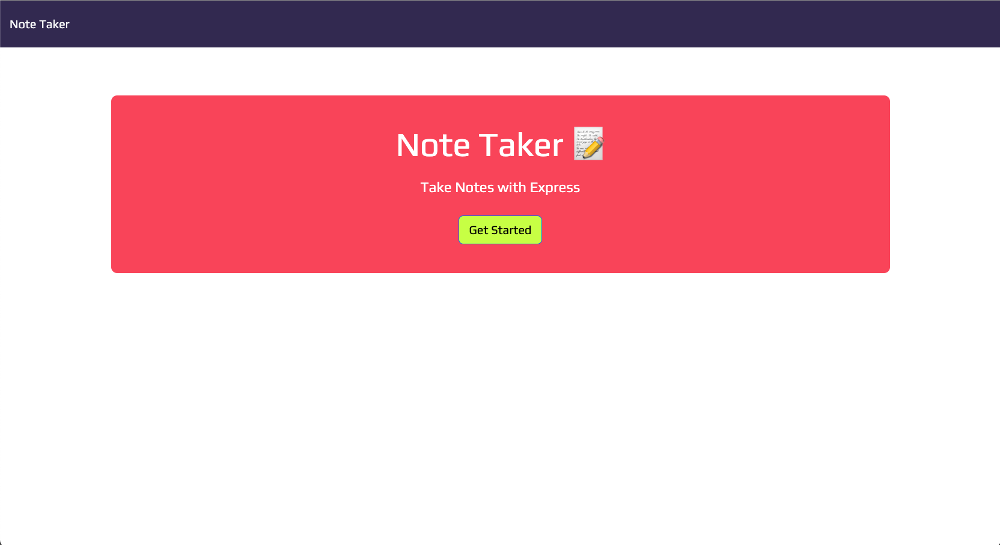

# Note-Taker
Challenge 11 due 2.2.23

## Description
An application to write and save notes using an Express.js back end that will save and retrieve note data from a JSON file.

## Screenshot

## Table of Contents
1. [Installation](#installation)
2. [Usage](#usage)
3. [Tests](#tests)
4. [License](#license)

## Installation
[Link to Deployed App on Heroku](https://shielded-cliffs-75455.herokuapp.com/) 

## Usage
Application can be used at the deployed live URL.

## Tests
N/A

## License

Licensed under the MIT license.

Copyright © YankeeKnight. All rights reserved.
